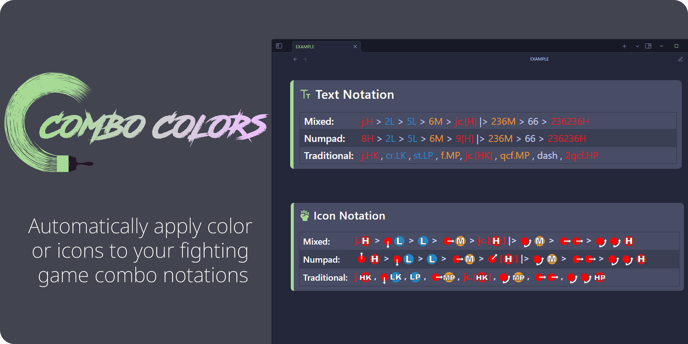

# Combo Colors
 
<a href="https://www.vecteezy.com/free-vector/paint-brush">Paint Brush Vectors by Vecteezy</a>

## Installation

**1.** Download the latest release from the <a href="https://github.com/kevinkickback/Combo-Colors/releases/">releases page</a> 
**2.** Extract the zip file into your Obsidian vault's `.obsidian/plugins/` folder 
**3.** Enable the plugin in Obsidian's Community Plugins settings

## How to Use

**1.** Add the `cc_profile` property to your markdown frontmatter with one of the following values:
   - `asw` - Arc System Works style (Guilty Gear, BlazBlue, etc.)
   - `alt` - Modern Alternative style (DNF Duel, Granblue, etc.)
   - `trd` - Traditional style (Street Fighter, Marvel vs Capcom Infinite, etc.)
   - **EXAMPLE:** `cc_profile: asw`  

**2.** Wrap your combo notations with `=:` and `:=` delimiters. 
   - **EXAMPLE:** `=:2A > 5B > 236C:=`  

**3.** (optional) Add `` `comboButton` `` anywhere in your markdown to create a text/image toggle button. You can also use the command palette and search for "Toggle notation icons"

## Customization

**1.** Go to Settings > Community Plugins > Combo Colors 
**2.** Select the desired notation profile 
**3.** Customize using the color picker

## NOTE:
This plugin was originally developed for personal use. Features such as adding or modifying profiles were not implemented, as I never needed them. Given my current schedule, it's unlikely I will work on these features in the future. However, if anyone is interested in building them, please feel free to do so—I’d be happy to commit the changes. Also, if you're looking for a much more comprehensive notation icon plugin please check out <a href="https://github.com/Loac/obsidian-fight-note">Obsidian Fight Note</a>.
