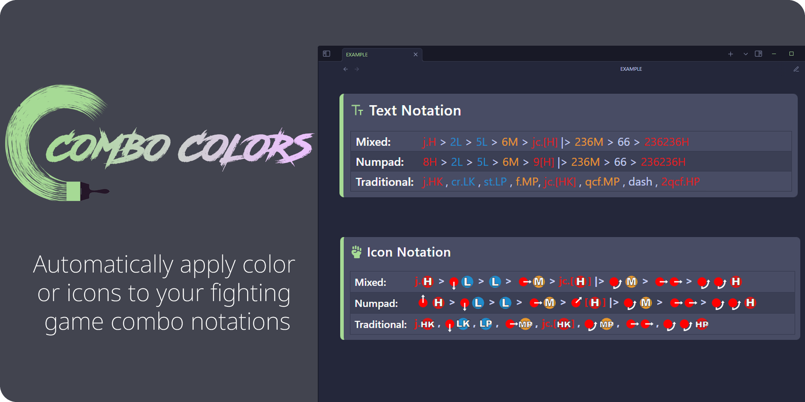

# Combo Colors
 

## Installation

**1.** Go to Settings > Community Plugins > Browse 
**2.** Search for "Combo Colors" 
**3.** Install then enable 

## How to Use

**1.** Add the `cc_profile` property to your file properties using a built-in profile ID or the ID of a custom profile:
   - `asw` - Arc System Works style (Guilty Gear, BlazBlue, etc.)
   - `alt` - Modern Alternative style (DNF Duel, Granblue, etc.)
   - `trd` - Traditional style (Street Fighter, Marvel vs Capcom Infinite, etc.)
   - **EXAMPLE:** `cc_profile: asw`  

**2.** Wrap your combo notations with `=:` and `:=` delimiters. 
   - **EXAMPLE:** `=:2A > 5B > 236C:=`  

**3.** (optional) Add `` `comboButton` `` anywhere in your markdown to create a text/image toggle button. You can also use the command palette and search for "Toggle notation icons". 
**4.** Open the complete shorthand reference from Settings > Combo Colors > About, or run "Open notation guide" from the command palette.

## Customization

### Custom profiles
**1.** Go to Settings > Community Plugins > Combo Colors 
**2.** Open Profiles, then click the "+" button beside the Active profile menu 
**3.** Enter a display name and Frontmatter ID (for example, "My Custom Profile" and "cstm") 
**4.** Select "Manage" under Profile inputs 
**5.** Add, edit, or remove as many inputs as needed, then select "Save" 
**6.** Use the profile by adding its ID to your file properties (for example, `cc_profile: cstm`)

The trash button beside the Active profile menu deletes the selected custom profile. It is disabled for built-in profiles.

### Change colors
**1.** Go to Settings > Community Plugins > Combo Colors 
**2.** Open Profiles and select the profile you want to customize 
**3.** Open Colors 
**4.** Choose a text or input color. Use the reset button beside a color to restore its default.

## Notation Guide

| Traditional | Numpad | Mixed |
|----------|---------|---------|
| `cr.A , st.B , qcf.C` | `2A > 5B > 236C` | `cr.A , 2B > qcf.C` |

| Notation | Meaning |
|----------|---------|
| `>` | Proceed from the previous move to the following move |
| `\|>` / `(Land)` | Indicate that the player must land at that point in the sequence |
| `,` | Link the previous move into the following move |
| `~` | Cancel the previous special into a follow-up |
| `dl.` | Delay the following move |
| `(whiff)` | The move must whiff (not hit) |
| `cl.` | Close |
| `f.` | Far |
| `j.` | Jumping/Aerial |
| `dj.` | Double Jump |
| `sj.` | Super Jump |
| `jc.` | Jump Cancel |
| `sjc.` | Super Jump Cancel |
| `dd.` / `22` | Double Down |
| `backdash` / `bb` / `44` | Back Dash |
| `ff` / `66` | Forward Dash |
| `CH` | Counter Hit |
| `[2]` / `[b]` / `[A]` | Hold a direction or profile input |
| `(sequence) xN` | Repeat sequence N amount of times |
| `(N)` | Hit N of a move or move must deal N amount of hits |
| `qcf.` / `236` | Quarter Circle Forward |
| `qcb.` / `214` | Quarter Circle Back |
| `dp.` / `623` | Dragon Punch |
| `rdp.` / `421` | Reverse Dragon Punch |
| `hcf.` / `41236` | Half Circle Forward |
| `hcb.` / `63214` | Half Circle Back |
| `2qcf.` / `236236` | Double Quarter Circle Forward |
| `2qcb.` / `214214` | Double Quarter Circle Back |
| `360` / `spd` | Full Circle |
| `720` | Double Circle |
| `1080` | Triple Circle |
| `2369` / `tk` | Tiger Knee |

## Notes

Combo Colors is intended to be used with reading view. Live preview is not supported.

For a standalone tool with additional features, see [notation.LABS](https://github.com/kevinkickback/notation.LABS).
